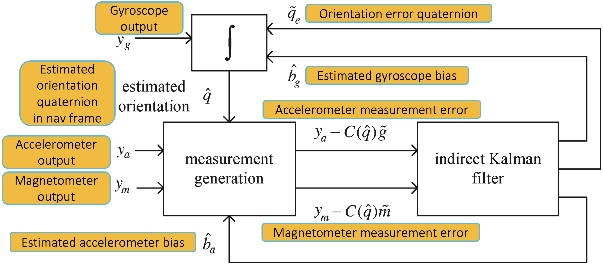

# __Attitude Estimation Using a Quaternion-Based Kalman Filter With Adaptive and Norm-Based Estimation of External Acceleration__

This project aimed to estimate the attitude of a vehicle using measurements from onboard sensors. The sensors used were inertial sensors (gyroscope and accelerometer) and a magnetometer. The project utilized quaternion algebra and an indirect Kalman filter to estimate the vehicle's orientation. To estimate external acceleration, two methods were employed: norm-based estimation [[1]](#references-1) and adaptive estimation [[2]](#references-2). The filter was tested using simulated and real data to validate its effectiveness.


<p align="center">
	<a href="#prerequisite">Prerequisite</a>
	<span> • </span>
	<a href="use">Use</a>
	<span> • </span>
	<a href="scripts">Scripts</a>
	<span> • </span>
	<a href="functions">Functions Library</a>
	<span> • </span>
	<a href="doc/presentation.pdf">Presentation</a>
	<span> • </span>
	<a href="#indirect-kalman-filter">Indirect Kalman Filter</a>
</p>


## References
1. <a id="references-1"></a>Y. S. Suh, "Orientation Estimation Using a Quaternion-Based Indirect Kalman Filter With Adaptive Estimation of External Acceleration," in IEEE Transactions on Instrumentation and Measurement, vol. 59, no. 12, pp. 3296-3305, Dec. 2010, doi:[10.1109/TIM.2010.2047157](https://doi.org/10.1109/TIM.2010.2047157)
2. <a id="references-2"></a>A. Nez, L. Fradet, F. Marin, T. Monnet and P. Lacouture, "Identification of Noise Covariance Matrices to Improve Orientation Estimation by Kalman Filter." Sensors 2018, 18, 3490, doi:[10.3390/s18103490](https://doi.org/10.3390/s18103490)
3. N. Trawny and S.I. Roumeliotis, "Indirect Kalman filter for 3D attitude estimation." In Technical Report; Department of Computer Science and Engineering, University of Minnesota: Minneapolis, MN, USA, 2005, [Google Scholar](https://scholar.google.com/scholar?&q=Trawny%2C%20N.%2C%20Roumeliotis%2C%20S.I.%3A%20Indirect%20Kalman%20filter%20for%203D%20attitude%20estimation.%20Technical%20Report%202005-002%2C%20University%20of%20Minnesota%2C%20Dept.%20of%20Comp.%20Sci.%20%26%20Eng.%2C%20MARS%20Lab.%20%28March%202005%29)
4. A. M. Sabatini, "Quaternion-based extended Kalman filter for determining orientation by inertial and magnetic sensing," in IEEE Transactions on Biomedical Engineering, vol. 53, no. 7, pp. 1346-1356, July 2006, doi:[10.1109/TBME.2006.875664](https://doi.org/10.1109/TBME.2006.875664)
5. R. Schneider and C. Georgakis, "How To NOT Make the Extended Kalman Filter Fail". Industrial & Engineering Chemistry Research 2013 52 (9), 3354-3362, doi:[10.1021/ie300415d](https://doi.org/10.1021/ie300415d)


## <a id="use"></a>How to Use
1. Add this repository to your MATLAB path (replace /path/to/this/repository with the actual path to the directory where the repository is located on your computer):
	```matlab
	addpath('/path/to/this/repository')
	```
2. Add your flight data to the __data__ folder
3. If desired, edit the scripts in the __scripts__ folder according to your needs as detailed [here](#scripts)
4. Run the `main.m` script
5. If the 'saving_flag' is turned on in the `plot_results.m` script, figures will be saved in the __img__ folder


## Folders
This repository contains four folders:

* __data__: Contains real data acquired from sensors and the magnetic field parameters used.
* __functions__: Contains a collection of low-level, useful MATLAB functions utilized by the scripts in the 'scripts' folder.
* __img__: Contains any figures saved if the 'saving_flag' is turned on.
* __scripts__: Contains MATLAB scripts that use the functions in the 'functions' folder.


## Data
The __data__ folder should contain flight data collected from real sensors (gyroscope, accelerometer, magnetometer, and inclinometer), as well as magnetic field parameters. The magnetic field parameters can be generated using the most recent World Magnetic Model (WMM) from 2019-2024, which can be accessed through the following link: [https://www.ngdc.noaa.gov/geomag/calculators/magcalc.shtml](https://www.ngdc.noaa.gov/geomag/calculators/magcalc.shtml).

The images presented in the [presentation](doc/presentation.pdf) were generated using magnetic field parameters calculated for a specific date (February 13th, 2020) and location (43°52'52"N, 10°14'6"E, Viareggio, IT) where real data was collected.


## Images
The __img__ folder contains the images generated and saved by the `plot_results.m` script.


## <a id="scripts"></a>Scripts
The __scripts__ folder contains all the scripts used. Possible editing, such as switching between synthetic and real data, should be done by modifying the code itself. All scripts have extensive comments in the code.

Notation used:

* `prev = k - 1` (or `k`, respectively)
* `next = k` (or `k + 1`, respectively)

e.g., `q_next_prev` denotes q(k|k-1) (or q(k+1|k), respectively)


1. __`generate_synthetic_data.m`__<br>
This script generates synthetic data.<br>
	* Please select one of the following rate_mode:
		* `null`: null rate
		* `const`: constant rate
		* `roll`: zero(0-50 s) - phi=phi+90° - zero (150-200 s)
		* `pitch`: zero(0-50 s) - theta=theta+45° - zero (150-200 s)
		* `yaw`: zero(0-50 s) - psi=psi+90° - zero (150-200 s)
		* `mult_const`: miscellaneous (multiple) constant rates
		* `mult_ramp`: miscellaneous (multiple), fast, ramp-like rates
	* Choose either `ON` or `OFF` (case insensitive, by the way):
		* noise_gyro: If `ON`, it adds noise to gyroscope measurements
		* noise_acc: If `ON`, it adds noise to accelerometer measurements
		* noise_mag: If `ON`, it adds noise to magnetometer measurements
		* bias_gyro: If `ON`, it adds bias to gyroscope measurements
		* bias_acc: If `ON`, it adds bias to accelerometer measurements
		* ext_acc: If `ON`, it creates 3 external accelerations:
			* $[10 m/s², 5 m/s², 20 m/s²]^T$ from $80 s$ to $81 s$
			* $[0 m/s², -7 m/s², 0 m/s²]^T$ from $120 s$ to $122 s$
			* $[-4 m/s², -3 m/s², 8 m/s²]^T$ from $140 s$ to $140.5 s$

2. __`import_real_data.m`__<br>
This script loads real data from the __data__ folder (the specific folder to be used is determined within the code.).<br>
	* Please select one of the following interpolation modes:
		* `1`: interpolates samples (using Matlab function `interp1(nearest)`)
		* `2`: linearly interpolates samples (using `lin_interpolate`, located in the __functions__ folder); it is a time-consuming task
		* `3`: loads previously interpolated data
	otherwise do nothing
	
	Make sure to adjust the paths according to your real __data__ folder location.

3. __`kalmanCorrect_acc.m`__<br>
This script adjusts the projected estimate by an actual accelerometer measurement at that time.<br>
	* Please select one of the following `Q_hat_a_b__algorithm`:
		* `suh`: uses Suh's algorithm [[1]](#references-1)
		* `sabatini`: uses Sabatini's algorithm [[2]](#references-2)
		* `zeros`: uses a (3 x 3) zeros matrix

4. __`kalmanCorrect_mag.m`__<br>
This script adjusts the projected estimate by an actual magnetometer measurement at that time.

5. __`kalmanPredict.m`__<br>
This script projects the current state estimate ahead in time by two actual gyroscope measurements: at that time and the previous one.

6. __`main.m`__<br>
This is the main script that should be executed on Matlab.<br>
	* Please select one of the following sensor_data types:
		* `synthetic`: Computer-generated sequence of angular velocity, acceleration, and magnetic field. See `generate_synthetic_data.m` for further details.
		* `real`: Load sequence of angular velocity, acceleration, magnetic field, and attitude measured by real sensors (gyroscope, accelerometer, magnetometer, and inclinometer, respectively). See `import_real_data.m` for further details.

7. __`plot_results.m`__<br>
This script has the capability to generate and, if desired, save all figures in the desired format (.png, .pdf, etc.). Users can customize the settings by selecting from the following options:

	* `saving_flag`: set this to `1` to save the generated plots in the desired format (specified in `image_extension`), and set it to any other value to disable saving.
	* `title_flag`: set this to `1` to enable adding titles to the generated plots, and set it to any other value to disable adding titles.
	* `plot_detected_ext_acc`: set this to `1` to display detected external acceleration instant dots on the acceleration plot, and set it to any other value to disable displaying detected external acceleration instant dots.
	* `image_extension`: specify the format for saving the images. This can include file types such as .png, .pdf, and so on.
	* `images_path`: set this variable to the folder path where you want to save the generated images (e.g., _'/Users/a\_user\_name/Documents/MATLAB/quaternion-kalman-filter/images'_). Modify the path as needed.
	* `main_path`: set this variable to the folder path where the source code is located (e.g., _'/Users/a\_user\_name/Documents/MATLAB/quaternion-kalman-filter'_). Modify the path as needed.


## <a id="functions"></a>Functions
The __functions__ folder includes a set of MATLAB functions library used by the scripts in the __scripts__ folder. A list of the functions contained in the folder and their descriptions can be found below.

1. __computeAccMode__
	```matlab
	function acceleration_mode = computeAccMode(lambda, mu)
	```
	[Eq. pre-34 Suh]<br>
	Computes Shu's acceleration mode, which is capable of detecting external acceleration (i.e., acceleration caused by forces other than gravity).
	* INPUT:
		* `lambda` &nbsp;&nbsp;&nbsp;&nbsp;&nbsp; The 3 eigenvalues of the matrix U, at times k, k-1, k-2 &nbsp;&nbsp;&nbsp;&nbsp;&nbsp; (3 x (M_2+1)) matrix
		* `mu` &nbsp;&nbsp;&nbsp;&nbsp;&nbsp; Defined after \[Eq. 32 Suh\] &nbsp;&nbsp;&nbsp;&nbsp;&nbsp; (3 x (M_2+1)) matrix
	* OUTPUT:
		* `acceleration_mode`  &nbsp;&nbsp;&nbsp;&nbsp;&nbsp;    Possible values:
			* '1' (i.e., `Mode 1` meaning 'No external acceleration Mode')
			* '2' (i.e., `Mode 2` meaning 'External acceleration Mode')


2. __create_extAcc__
	```matlab
	function a_b = create_extAcc(a_b_OLD, t_i, ext_acc, length)
	```
	Generates constant external acceleration ext_acc from `t_i` to `t_i + length`, overwriting previous external acceleration `a_b_OLD`.
	* INPUT:
		* `a_b_OLD` &nbsp;&nbsp;&nbsp;&nbsp;&nbsp; Previous external acceleration; it'll be overwritten &nbsp;&nbsp;&nbsp;&nbsp;&nbsp; (3 x N_samples) vector &nbsp;&nbsp;&nbsp;&nbsp;&nbsp; [m / s^2]
		* `t_i` &nbsp;&nbsp;&nbsp;&nbsp;&nbsp; Ext. acc. starting (initial) time &nbsp;&nbsp;&nbsp;&nbsp;&nbsp; scalar &nbsp;&nbsp;&nbsp;&nbsp;&nbsp; [s]
		* `ext_acc` &nbsp;&nbsp;&nbsp;&nbsp;&nbsp; Ext. acc. constant value &nbsp;&nbsp;&nbsp;&nbsp;&nbsp; (3 x 1) vector &nbsp;&nbsp;&nbsp;&nbsp;&nbsp; [m / s^2]
		* `length` &nbsp;&nbsp;&nbsp;&nbsp;&nbsp; Ext. acc. duration &nbsp;&nbsp;&nbsp;&nbsp;&nbsp; scalar &nbsp;&nbsp;&nbsp;&nbsp;&nbsp; [s]
	* OUTPUT:
		* `a_b` &nbsp;&nbsp;&nbsp;&nbsp;&nbsp; External acceleration a\_b(t) &nbsp;&nbsp;&nbsp;&nbsp;&nbsp; (3 x N_samples) vector  [m / s^2]


3. __estimateExtAccCov_Sab__
	```matlab
	function Q_hat_a_b = estimateExtAccCov_Sab(y_a)
	```
	[Eq. 37 Suh]<br>
	Implements the accelerometer norm-based adaptive algorithm by A. M. Sabatini [[1]](#references-1) for estimating external acceleration covariance matrix `Q__a_b`.
	* INPUT:
		* `y_a` &nbsp;&nbsp;&nbsp;&nbsp;&nbsp; Measured acceleration &nbsp;&nbsp;&nbsp;&nbsp;&nbsp; (3 x 1) vector &nbsp;&nbsp;&nbsp;&nbsp;&nbsp; [m/s^2]
	* OUTPUT:
		* `Q_hat_a_b` &nbsp;&nbsp;&nbsp;&nbsp;&nbsp; Estimated external acceleration covariance &nbsp;&nbsp;&nbsp;&nbsp;&nbsp; (3 x 3) matrix &nbsp;&nbsp;&nbsp;&nbsp;&nbsp; [-]


4. __estimateExtAccCov_Suh__
	```matlab
	function [Q_hat_a_b, lambda, mu] = estimateExtAccCov_Suh(r_a, lambda, mu, H_a, P__next_prev, R_a)
	```
	[Eq. 34 - 35 Suh]<br>
	Implements the adaptive estimation algorithm by Y. S. Suh [[2]](#references-2) for estimating external acceleration covariance matrix `Q__a_b`.
	* INPUT:
		* `r_a` &nbsp;&nbsp;&nbsp;&nbsp;&nbsp; Residual in the accelerometer measurement update &nbsp;&nbsp;&nbsp;&nbsp;&nbsp; (3 x M_1) vector &nbsp;&nbsp;&nbsp;&nbsp;&nbsp; [m / s^2]
		* `lambda` &nbsp;&nbsp;&nbsp;&nbsp;&nbsp; Threshold between first and second condition &nbsp;&nbsp;&nbsp;&nbsp;&nbsp; (3 x (M_2+1)) matrix
		* `mu` &nbsp;&nbsp;&nbsp;&nbsp;&nbsp; Defined after \[Eq. 32 Suh] &nbsp;&nbsp;&nbsp;&nbsp;&nbsp; (3 x (M_2+1)) matrix
		* `H_a` &nbsp;&nbsp;&nbsp;&nbsp;&nbsp; Accelerometer measurement matrix &nbsp;&nbsp;&nbsp;&nbsp;&nbsp; (3 x 9) matrix
		* `P__next_prev` &nbsp;&nbsp;&nbsp;&nbsp;&nbsp; State covariance matrix &nbsp;&nbsp;&nbsp;&nbsp;&nbsp; (9 x 9) matrix
		* `R_a` &nbsp;&nbsp;&nbsp;&nbsp;&nbsp; Covariance measurement matrix of the accelerometer &nbsp;&nbsp;&nbsp;&nbsp;&nbsp; (3 x 3) matrix
	* OUTPUT:
		* `Q_hat_a_b` &nbsp;&nbsp;&nbsp;&nbsp;&nbsp; Estimated external acceleration covariance &nbsp;&nbsp;&nbsp;&nbsp;&nbsp; (3 x 3) matrix
		* `lambda` &nbsp;&nbsp;&nbsp;&nbsp;&nbsp; (newly computed) lambda &nbsp;&nbsp;&nbsp;&nbsp;&nbsp; (3 x (M_2+1)) matrix
		* `mu` &nbsp;&nbsp;&nbsp;&nbsp;&nbsp; (newly computed) mu &nbsp;&nbsp;&nbsp;&nbsp;&nbsp; (3 x (M_2+1)) matrix


5. __euler2quat__
	```matlab
	function q = euler2quat(angles)
	```
	[[https://marc-b-reynolds.github.io/math/2017/04/18/TaitEuler.html#mjx-eqn%3Aeq%3Atait](https://marc-b-reynolds.github.io/math/2017/04/18/TaitEuler.html#mjx-eqn%3Aeq%3Atait), Eq. 2 - 3 - 4 - 5]<br>
	Converts Euler angles to quaternion.
	* INPUT:
		* `angles` &nbsp;&nbsp;&nbsp;&nbsp;&nbsp; Euler angles (angles = [roll; pitch; yaw]) &nbsp;&nbsp;&nbsp;&nbsp;&nbsp; (3 x 1) vector &nbsp;&nbsp;&nbsp;&nbsp;&nbsp; [rad]
	* OUTPUT:
		* `q` &nbsp;&nbsp;&nbsp;&nbsp;&nbsp; Quaternion (`q` = [q0; q1; q2; q3], where the first element, q0, is the scalar part aka real part) &nbsp;&nbsp;&nbsp;&nbsp;&nbsp; (4 x 1) vector &nbsp;&nbsp;&nbsp;&nbsp;&nbsp; [-]


6. __euler2RotMat__
	```matlab
	function C = euler2RotMat(angles)
	```
	Converts Euler angles to rotation matrix (aka Direction Cosine Matrix, DCM).
	The Euler angles rotate the frame `n` (navigation) to the frame `b` (body) according to the 'zyx' sequence.
	* INPUT:
		* `angles` &nbsp;&nbsp;&nbsp;&nbsp;&nbsp; Euler angles (angles = [roll; pitch; yaw]) &nbsp;&nbsp;&nbsp;&nbsp;&nbsp; (3 x 1) vector &nbsp;&nbsp;&nbsp;&nbsp;&nbsp; [rad]
	* OUTPUT:
		* `C` &nbsp;&nbsp;&nbsp;&nbsp;&nbsp; Coordinate transformation matrix from n to b            (3 x 3) matrix &nbsp;&nbsp;&nbsp;&nbsp;&nbsp; [-]
			    N.B.: That is, `v_b  = C * v_n`.
                            (`_b` or `_n` are the frames in which the vector `v` can be expressed, representing the body and navigation frames, respectively.)


7. __euler_angle_range_three_axis__
	```matlab
	function a = euler_angle_range_three_axis(angles)
	```
	Limits Euler angles range.
	For three-axis rotation, the angle ranges are [-pi, pi], [-pi/2, pi/2] and [-pi, pi].
	For two-axis rotation, the angle ranges are [-pi, pi], [0, pi] and [-pi, pi].
	* INPUT:
		* `angles` &nbsp;&nbsp;&nbsp;&nbsp;&nbsp; Euler angles &nbsp;&nbsp;&nbsp;&nbsp;&nbsp; (3 x 1) vector &nbsp;&nbsp;&nbsp;&nbsp;&nbsp; [rad]
	* OUTPUT:
		* `a` &nbsp;&nbsp;&nbsp;&nbsp;&nbsp; Limited Euler angles &nbsp;&nbsp;&nbsp;&nbsp;&nbsp; (3 x 1) vector &nbsp;&nbsp;&nbsp;&nbsp;&nbsp; [rad]


8. __lin_interpolate__
	```matlab
	function values_interpolated = lin_interpolate(T, values, N_samples, N_samples__theoretical)
	```
	[Eq. pre-34 Suh]<br>
	Linearly interpolates values.
	* INPUT:
		* `T` &nbsp;&nbsp;&nbsp;&nbsp;&nbsp; Time stamp array &nbsp;&nbsp;&nbsp;&nbsp;&nbsp; (1 x `N_samples`) vector &nbsp;&nbsp;&nbsp;&nbsp;&nbsp; 	[s]
		* `values` &nbsp;&nbsp;&nbsp;&nbsp;&nbsp; Array with elements to be interpolated &nbsp;&nbsp;&nbsp;&nbsp;&nbsp; (1 x `N_samples`) vector &nbsp;&nbsp;&nbsp;&nbsp;&nbsp; 	[-]
		* `N_samples` &nbsp;&nbsp;&nbsp;&nbsp;&nbsp; Number of samples of T and values &nbsp;&nbsp;&nbsp;&nbsp;&nbsp; scalar &nbsp;&nbsp;&nbsp;&nbsp;&nbsp; [-]
		* `N_samples__theoretical` &nbsp;&nbsp;&nbsp;&nbsp;&nbsp; Theoretical number of samples &nbsp;&nbsp;&nbsp;&nbsp;&nbsp; scalar &nbsp;&nbsp;&nbsp;&nbsp;&nbsp; [-]
	* OUTPUT:
		* `values_interpolated` &nbsp;&nbsp;&nbsp;&nbsp;&nbsp; `N_samples__theoretical` interpolated values &nbsp;&nbsp;&nbsp;&nbsp;&nbsp; (1 x `N_samples__theoretical`) array &nbsp;&nbsp;&nbsp;&nbsp;&nbsp; [-]<br>
		N.B.: `N_samples <= N_samples__theoretical`


9. __omega2quat__
	```matlab
	function q = omega2quat(omega)
	```
	Creates a pure imaginary quaternion (i.e., null scalar part, that is, `q(1) = 0`) from the angular velocity omega.<br>
	Please note: the quaternion thus obtained is NOT a unitary quaternion.
	* INPUT:
		* `omega` &nbsp;&nbsp;&nbsp;&nbsp;&nbsp; Angular velocity omega(k) &nbsp;&nbsp;&nbsp;&nbsp;&nbsp; (3 x 1) vector &nbsp;&nbsp;&nbsp;&nbsp;&nbsp; [rad / s]
	* OUTPUT:
		* `q` &nbsp;&nbsp;&nbsp;&nbsp;&nbsp; Quaternion (`q` = [q0; q1; q2; q3], where the first element, q0, is the scalar part aka real part) &nbsp;&nbsp;&nbsp;&nbsp;&nbsp; (4 x 1) vector &nbsp;&nbsp;&nbsp;&nbsp;&nbsp; [-]


10. __Omega__
	```matlab
	function Omega_omega = Omega(omega)
	```
	[Eq. A12 ("A Kalman Filter for Nonlinear Attitude Estimation Using Time Variable Matrices and Quaternions" - Alvaro Deibe)]<br>
	Computes the Omega(omega) matrix.<br>
	N.B.: Omega(omega) appears in the product of a vector and a quaternion, and is used for example in the quaternion derivative.<br>
	(N.B.: [Eq. 64 Trawny] DOES NOT work properly anymore, probably since `q(1) = q_0` is the scalar part)
	* INPUT:
		* `omega_next` &nbsp;&nbsp;&nbsp;&nbsp;&nbsp; Angular velocity omega(k) &nbsp;&nbsp;&nbsp;&nbsp;&nbsp; (3 x 1) vector &nbsp;&nbsp;&nbsp;&nbsp;&nbsp; [rad / s]
	* OUTPUT:
		* `Omega__omega` &nbsp;&nbsp;&nbsp;&nbsp;&nbsp; Omega matrix &nbsp;&nbsp;&nbsp;&nbsp;&nbsp; (3 x 3) matrix


11. __Omega_avg_omega__
	```matlab
	function Omega__avg_omega = Omega_avg_omega(omega_next, omega_prev, dt)
	```
	[Eq. 129 Trawny]<br>
	Computes the Omega(omega_avg) matrix.
	* INPUT:
		* `omega_next` &nbsp;&nbsp;&nbsp;&nbsp;&nbsp; Angular velocity omega(k+1) &nbsp;&nbsp;&nbsp;&nbsp;&nbsp; (3 x 1) vector &nbsp;&nbsp;&nbsp;&nbsp;&nbsp; [rad / s]
		* `omega_prev` &nbsp;&nbsp;&nbsp;&nbsp;&nbsp; Angular velocity omega(k) &nbsp;&nbsp;&nbsp;&nbsp;&nbsp; (3 x 1) vector &nbsp;&nbsp;&nbsp;&nbsp;&nbsp; [rad / s]
		* `dt` &nbsp;&nbsp;&nbsp;&nbsp;&nbsp; Time step (`dt` = t(k+1) - t(k)) &nbsp;&nbsp;&nbsp;&nbsp;&nbsp; scalar &nbsp;&nbsp;&nbsp;&nbsp;&nbsp; [s]
	* OUTPUT:
		* `Omega__avg_omega` &nbsp;&nbsp;&nbsp;&nbsp;&nbsp; Omega(omega_avg) matrix &nbsp;&nbsp;&nbsp;&nbsp;&nbsp; (3 x 3) matrix &nbsp;&nbsp;&nbsp;&nbsp;&nbsp; [rad / s]


12. __Omega_dot_omega__
	```matlab
	function Omega__dot_omega = Omega_dot_omega(omega_next, omega_prev, dt)
	```
	[Eq. 126 Trawny]<br>
	Defines the derivative of the turn rate (omega\_dot) and the associated matrix (Omega(omega_dot)), which - in the linear case - is constant.
	* INPUT:
		* `omega_next` &nbsp;&nbsp;&nbsp;&nbsp;&nbsp; Angular velocity omega(k+1) &nbsp;&nbsp;&nbsp;&nbsp;&nbsp; (3 x 1) vector &nbsp;&nbsp;&nbsp;&nbsp;&nbsp; [rad / s]
		* `omega_prev` &nbsp;&nbsp;&nbsp;&nbsp;&nbsp; Angular velocity omega(k) &nbsp;&nbsp;&nbsp;&nbsp;&nbsp; (3 x 1) vector &nbsp;&nbsp;&nbsp;&nbsp;&nbsp; [rad / s]
		* `dt` &nbsp;&nbsp;&nbsp;&nbsp;&nbsp; Time step (`dt` = t(k+1) - t(k)) &nbsp;&nbsp;&nbsp;&nbsp;&nbsp; scalar &nbsp;&nbsp;&nbsp;&nbsp;&nbsp; [s]
	* OUTPUT:
		* `Omega__dot_omega` &nbsp;&nbsp;&nbsp;&nbsp;&nbsp; Omega matrix &nbsp;&nbsp;&nbsp;&nbsp;&nbsp; (3 x 3) matrix


13. __Phi_matrix__
	```matlab
	function Phi = Phi_matrix(y_g__next, Phi_mode)
	```
	[Eq. post-15 Suh] \('precise') OR [Eq. 16a Suh] \('approximated') OR [Eq. 187 Trawny] \('Trawny')<br>
	Computes the transition matrix Phi(t + dt, t).
	* INPUT:
		* `y_g__next` &nbsp;&nbsp;&nbsp;&nbsp;&nbsp; Measured angular velocity (i.e., gyro output) y_g(k) &nbsp;&nbsp;&nbsp;&nbsp;&nbsp; (3 x 1) vector &nbsp;&nbsp;&nbsp;&nbsp;&nbsp; [rad / s]
		* `Phi_mode` &nbsp;&nbsp;&nbsp;&nbsp;&nbsp; Possible values:
			* `precise`:        [Eq. post-15 Suh]
			* `approximated`:   [Eq. 16a Suh]
			* `Trawny`:         [Eq. 187 Trawny]
	* OUTPUT:
		* `Phi` &nbsp;&nbsp;&nbsp;&nbsp;&nbsp; Transition matrix Phi(t + dt, t) &nbsp;&nbsp;&nbsp;&nbsp;&nbsp; (9 x 9) matrix


14. __Q_d_matrix__
	```matlab
	function Q_d = Q_d_matrix(y_g__next, Q_d_mode)
	```
	[Eq. post-15 Suh] \('precise') OR [Eq. 16b Suh] \('approximated') OR [Eq. 208 Trawny] \('Trawny')<br>
	Computes the Noise Covariance Matrix `Q_d`.
	* INPUT:
		* `y_g__next` &nbsp;&nbsp;&nbsp;&nbsp;&nbsp; Measured angular velocity (i.e., gyro output) y_g(k) &nbsp;&nbsp;&nbsp;&nbsp;&nbsp; (3 x 1) vector &nbsp;&nbsp;&nbsp;&nbsp;&nbsp; [rad / s]
		* `Q_d_mode` &nbsp;&nbsp;&nbsp;&nbsp;&nbsp; Possible values:
			* 'precise':        [Eq. post-15 Suh]
			* 'approximated':   [Eq. 16a Suh]
	* OUTPUT:
		* `Q_d` &nbsp;&nbsp;&nbsp;&nbsp;&nbsp; Noise Covariance Matrix Q\_d(k) &nbsp;&nbsp;&nbsp;&nbsp;&nbsp; (9 x 9) matrix


15. __quat2euler__
	```matlab
	function r = quat2euler(q)
	```
	[https://marc-b-reynolds.github.io/math/2017/04/18/TaitEuler.html#mjx-eqn%3Aeq%3Atait](https://marc-b-reynolds.github.io/math/2017/04/18/TaitEuler.html#mjx-eqn%3Aeq%3Atait])<br>
	Converts quaternion to Euler angles.
	* INPUT:
		* `q` &nbsp;&nbsp;&nbsp;&nbsp;&nbsp; Quaternion (`q` = [q0; q1; q2; q3], where the first element, q0, is the scalar part aka real part) &nbsp;&nbsp;&nbsp;&nbsp;&nbsp; (4 x 1) vector &nbsp;&nbsp;&nbsp;&nbsp;&nbsp; [-]
	* OUTPUT:
		* `r` &nbsp;&nbsp;&nbsp;&nbsp;&nbsp; Euler angles (`r` = [roll; pitch; yaw]) &nbsp;&nbsp;&nbsp;&nbsp;&nbsp; (3 x 1) vector &nbsp;&nbsp;&nbsp;&nbsp;&nbsp; [rad]


16. __quat2RotMat__
	```matlab
	function C_from_q = quat2RotMat(q)
	```
	[Eq. 90 Trawny] [Eq. 1 Suh]<br>
	Computes the rotation matrix associated to the quaternion `q`.
	* INPUT:
		* `q` &nbsp;&nbsp;&nbsp;&nbsp;&nbsp; Quaternion (`q` = [q0; q1; q2; q3], where the first element, q0, is the scalar part aka real part) &nbsp;&nbsp;&nbsp;&nbsp;&nbsp; (4 x 1) vector &nbsp;&nbsp;&nbsp;&nbsp;&nbsp; [-]
	* OUTPUT:
		* `C_from_q` &nbsp;&nbsp;&nbsp;&nbsp;&nbsp; Coordinate transformation matrix associated to `q` &nbsp;&nbsp;&nbsp;&nbsp;&nbsp; (3 x 3) matrix &nbsp;&nbsp;&nbsp;&nbsp;&nbsp; [-]


17. __quatConjugate__
	```matlab
	function q_conjugate = quatConjugate(q)
	```
	[Eq. 13 Trawny]<br>
	Takes the complex conjugate (that is, the inverse for a unit quaternion) of a given quaternion.<br>
	N.B.: The inverse rotation is described by the inverse or complex conjugate quaternion).
	* INPUT:
		* `q` &nbsp;&nbsp;&nbsp;&nbsp;&nbsp; Quaternion q(k) (`q` = [q0; q1; q2; q3], where the first element, q0, is the scalar part aka real part) &nbsp;&nbsp;&nbsp;&nbsp;&nbsp; (4 x 1) vector &nbsp;&nbsp;&nbsp;&nbsp;&nbsp; [-]
	* OUTPUT:
		* `q_conjugate` &nbsp;&nbsp;&nbsp;&nbsp;&nbsp; (not unitary) Quaternion, conjugate of `q` &nbsp;&nbsp;&nbsp;&nbsp;&nbsp; (4 x 1) vector &nbsp;&nbsp;&nbsp;&nbsp;&nbsp; [-]


18. __quatDerivative__
	```matlab
	function q_dot = quatDerivative(q, omega)
	```
	[Eq. 106 Trawny] OR \[Eq. 2 Suh] (and [Eq. 4 Suh])<br>
	Computes the quaternion derivative.
	* INPUT:
		* `q` &nbsp;&nbsp;&nbsp;&nbsp;&nbsp; Quaternion (`q` = [q0; q1; q2; q3], where the first element, q0, is the scalar part aka real part) &nbsp;&nbsp;&nbsp;&nbsp;&nbsp; (4 x 1) vector &nbsp;&nbsp;&nbsp;&nbsp;&nbsp; [-]
		* `omega` &nbsp;&nbsp;&nbsp;&nbsp;&nbsp; Angular velocity omega(k) &nbsp;&nbsp;&nbsp;&nbsp;&nbsp; (3 x 1) vector &nbsp;&nbsp;&nbsp;&nbsp;&nbsp; [rad / s]
	* OUTPUT:
		* `q_do`, &nbsp;&nbsp;&nbsp;&nbsp;&nbsp; Quaternion derivative of `q` &nbsp;&nbsp;&nbsp;&nbsp;&nbsp; (4 x 1) vector &nbsp;&nbsp;&nbsp;&nbsp;&nbsp; [1 / s]


19. __quatFirstIntegration__
	```matlab
	function q_next = quatFirstIntegration(q_prev, omega_next, omega_prev, integration_mode)
	```
	[Eq. 18 Suh] \('Suh') OR [Eq. 131 Trawny] \('Trawny') OR [Eq. 8 Yuan] \('Yuan')<br>
	Computes the first-order quaternion integration.
	It makes the assumption of a linear evolution of omega during the integration interval dt.<br>
	N.B.: Use `Suh` for `integration_mode`, not `Trawny`.
	* INPUT:
		* `q` &nbsp;&nbsp;&nbsp;&nbsp;&nbsp; Quaternion q(k) (`q` = [q0; q1; q2; q3], where the first element, q0, is the scalar part aka real part) &nbsp;&nbsp;&nbsp;&nbsp;&nbsp; (4 x 1) vector &nbsp;&nbsp;&nbsp;&nbsp;&nbsp; [-]
		* `omega_next` &nbsp;&nbsp;&nbsp;&nbsp;&nbsp; Angular velocity omega(k+1) &nbsp;&nbsp;&nbsp;&nbsp;&nbsp; (3 x 1) vector &nbsp;&nbsp;&nbsp;&nbsp;&nbsp; [rad/s]
		* `omega_prev` &nbsp;&nbsp;&nbsp;&nbsp;&nbsp; Angular velocity omega(k) &nbsp;&nbsp;&nbsp;&nbsp;&nbsp; (3 x 1) vector &nbsp;&nbsp;&nbsp;&nbsp;&nbsp; [rad/s]
		* `integration_mode` &nbsp;&nbsp;&nbsp;&nbsp;&nbsp; Modality of integration:
			* `Suh`,    [Eq. 18 Suh]
			* `Trawny`, [Eq. 131 Trawny]
			* `Yuan`,   [Eq. 8 Yuan]
	* OUTPUT:
		* `q_next` &nbsp;&nbsp;&nbsp;&nbsp;&nbsp; q(k+1); unit quaternion from integration of `q` &nbsp;&nbsp;&nbsp;&nbsp;&nbsp; (4 x 1) vector &nbsp;&nbsp;&nbsp;&nbsp;&nbsp; [-]


20. __quatInverse__
	```matlab
	function q_inverse = quatInverse(q)
	```
	[Eq. 13 Trawny]<br>
	Takes the inverse of a given quaternion.<br>
	(N.B.: The inverse rotation is described by the inverse - or complex conjugate for unit quaternions quaternion)
	* INPUT:
		* `q` &nbsp;&nbsp;&nbsp;&nbsp;&nbsp; Quaternion q(k) (`q` = [q0; q1; q2; q3], where the first element, q0, is the scalar part aka real part) &nbsp;&nbsp;&nbsp;&nbsp;&nbsp; (4 x 1) vector &nbsp;&nbsp;&nbsp;&nbsp;&nbsp; [-]
	* OUTPUT:
		* `q_inverse` &nbsp;&nbsp;&nbsp;&nbsp;&nbsp; (not unitary) Quaternion, the inverse of `q` &nbsp;&nbsp;&nbsp;&nbsp;&nbsp; (4 x 1) vector &nbsp;&nbsp;&nbsp;&nbsp;&nbsp; [-]


21. __quatMultiplication__
	```matlab
	function q_times_p = quatMultiplication(q, p)
	```
	[https://en.wikipedia.org/wiki/Quaternion#Hamilton_product](https://en.wikipedia.org/wiki/Quaternion#Hamilton_product)<br>
	Multiplies the quaternions `q` and `p`, thus obtaining their Hamilton product.<br>
	Please note: the quaternion product is NOT commutative!<br>
	(N.B.: [Eq. post-5 Trawny] is not used)	
	* INPUT:
		* `q` &nbsp;&nbsp;&nbsp;&nbsp;&nbsp; Quaternion q(k) (`q` = [q0; q1; q2; q3], where the first element, q0, is the scalar part aka real part) &nbsp;&nbsp;&nbsp;&nbsp;&nbsp; (4 x 1) vector &nbsp;&nbsp;&nbsp;&nbsp;&nbsp; [-]
		* `p` &nbsp;&nbsp;&nbsp;&nbsp;&nbsp; Quaternion p(k) (`p` = [p0; p1; p2; p3], p0 is the scalar) &nbsp;&nbsp;&nbsp;&nbsp;&nbsp; (4 x 1) vector &nbsp;&nbsp;&nbsp;&nbsp;&nbsp; [-]
	* OUTPUT:
		* `q_times_p` &nbsp;&nbsp;&nbsp;&nbsp;&nbsp; (not unitary) Quaternion, the product of (in this order) `q` and `p` &nbsp;&nbsp;&nbsp;&nbsp;&nbsp; (4 x 1) vector &nbsp;&nbsp;&nbsp;&nbsp;&nbsp; [-]


22. __rand_range__
	```matlab
	function x = rand_range(xmin, xmax)
	```
	[https://it.mathworks.com/matlabcentral/answers/66763-generate-random-numbers-in-range-from-0-8-to-4](https://it.mathworks.com/matlabcentral/answers/66763-generate-random-numbers-in-range-from-0-8-to-4)<br>
	Generates a value from the uniform distribution on the interval (`xmin`, `xmax`).
	* INPUT:
		* `xmin` &nbsp;&nbsp;&nbsp;&nbsp;&nbsp; Minimum possible value &nbsp;&nbsp;&nbsp;&nbsp;&nbsp; scalar &nbsp;&nbsp;&nbsp;&nbsp;&nbsp; [-]
		* `xmax` &nbsp;&nbsp;&nbsp;&nbsp;&nbsp; Maximum possible value &nbsp;&nbsp;&nbsp;&nbsp;&nbsp; scalar &nbsp;&nbsp;&nbsp;&nbsp;&nbsp; [-]
	* OUTPUT:
		* `x` &nbsp;&nbsp;&nbsp;&nbsp;&nbsp; Pseudo-random number in (`xmin`, `xmax`) &nbsp;&nbsp;&nbsp;&nbsp;&nbsp; scalar &nbsp;&nbsp;&nbsp;&nbsp;&nbsp; [-]


23. __RotMat2euler__
	```matlab
	function r = RotMat2euler(C)
	```
	[https://d3cw3dd2w32x2b.cloudfront.net/wp-content/uploads/2012/07/euler-angles1.pdf](https://d3cw3dd2w32x2b.cloudfront.net/wp-content/uploads/2012/07/euler-angles1.pdf)<br>
	Converts direction cosine matrix to Euler angles ('zyx' sequence).<br>
	N.B.: "We’ll follow the notational conventions of Shoemake’s “Euler Angle Conversion”, Graphics Gems IV, pp. 222-9".
	* INPUT:
		* `C` &nbsp;&nbsp;&nbsp;&nbsp;&nbsp; Coordinate transformation matrix &nbsp;&nbsp;&nbsp;&nbsp;&nbsp; (3 x 3) matrix &nbsp;&nbsp;&nbsp;&nbsp;&nbsp; [-]
	* OUTPUT:
		* `r` &nbsp;&nbsp;&nbsp;&nbsp;&nbsp; Euler angles (r = [roll; pitch; yaw]) &nbsp;&nbsp;&nbsp;&nbsp;&nbsp; (3 x 1) vector &nbsp;&nbsp;&nbsp;&nbsp;&nbsp; [rad]


24. __RotMat2quat__
	```matlab
	function q = RotMat2quat(C)
	```
	[Eq. 98a - 98b - 99a - 99b Trawny]<br>
	Converts direction cosine matrix to quaternion.
	* INPUT:
		* `C` &nbsp;&nbsp;&nbsp;&nbsp;&nbsp; Coordinate transformation matrix &nbsp;&nbsp;&nbsp;&nbsp;&nbsp; (3 x 3) matrix &nbsp;&nbsp;&nbsp;&nbsp;&nbsp; [-]
	* OUTPUT:
		* `q` &nbsp;&nbsp;&nbsp;&nbsp;&nbsp; Quaternion (`q` = [q0; q1; q2; q3], where the first element, q0, is the scalar part aka real part) &nbsp;&nbsp;&nbsp;&nbsp;&nbsp; (4 x 1) vector &nbsp;&nbsp;&nbsp;&nbsp;&nbsp; [-]


25. __rotX__
	```matlab
	function C_x = rotX(alpha)
	```
	Computes a basic rotation about the x-axis by an angle `alpha`.
	* INPUT:
		* `alpha` &nbsp;&nbsp;&nbsp;&nbsp;&nbsp; angle &nbsp;&nbsp;&nbsp;&nbsp;&nbsp; scalar &nbsp;&nbsp;&nbsp;&nbsp;&nbsp; [rad]
	* OUTPUT:
		* `C` &nbsp;&nbsp;&nbsp;&nbsp;&nbsp; Coordinate transformation matrix &nbsp;&nbsp;&nbsp;&nbsp;&nbsp; (3 x 3) matrix &nbsp;&nbsp;&nbsp;&nbsp;&nbsp; [-]


26. __rotY__
	```matlab
	function C_y = rotY(alpha)
	```
	Computes a basic rotation about the y-axis by an angle `alpha`.
	* INPUT:
		* `alpha` &nbsp;&nbsp;&nbsp;&nbsp;&nbsp; angle &nbsp;&nbsp;&nbsp;&nbsp;&nbsp; scalar &nbsp;&nbsp;&nbsp;&nbsp;&nbsp; [rad]
	* OUTPUT:
		* `C` &nbsp;&nbsp;&nbsp;&nbsp;&nbsp; Coordinate transformation matrix &nbsp;&nbsp;&nbsp;&nbsp;&nbsp; (3 x 3) matrix &nbsp;&nbsp;&nbsp;&nbsp;&nbsp; [-]


27. __rotZ__
	```matlab
	function C_y = rotY(alpha)
	```
	Computes a basic rotation about the z-axis by an angle `alpha`.
	* INPUT:
		* `alpha` &nbsp;&nbsp;&nbsp;&nbsp;&nbsp; angle &nbsp;&nbsp;&nbsp;&nbsp;&nbsp; scalar &nbsp;&nbsp;&nbsp;&nbsp;&nbsp; [rad]
	* OUTPUT:
		* `C` &nbsp;&nbsp;&nbsp;&nbsp;&nbsp; Coordinate transformation matrix &nbsp;&nbsp;&nbsp;&nbsp;&nbsp; (3 x 3) matrix &nbsp;&nbsp;&nbsp;&nbsp;&nbsp; [-]


28. __skewSymmetric__
	```matlab
	function skew_symmetric_matrix = skewSymmetric(p)
	```
	[Eq. post-9 Suh]<br>
	Computes the skew-symmetric matrix operator [px], formed from `p`.
	* INPUT:
		* `p` &nbsp;&nbsp;&nbsp;&nbsp;&nbsp; Possible values:
			* angular velocity, &nbsp;&nbsp;&nbsp;&nbsp;&nbsp; (3 x 1) vector &nbsp;&nbsp;&nbsp;&nbsp;&nbsp; [rad / s]
			* quaternion (only the vector part (aka imaginary part) of `p` is considered), &nbsp;&nbsp;&nbsp;&nbsp;&nbsp; (4 x 1) vector &nbsp;&nbsp;&nbsp;&nbsp;&nbsp; [-]
	* OUTPUT:
		* `skew_symmetric_matrix` &nbsp;&nbsp;&nbsp;&nbsp;&nbsp; Skew-symmetric matrix formed from `p` &nbsp;&nbsp;&nbsp;&nbsp;&nbsp; (3 x 3) matrix &nbsp;&nbsp;&nbsp;&nbsp;&nbsp; [-]


29. __wrapTo90__
	```matlab
	function alpha_wrapped = wrapTo90(alpha)
	```
	[https://it.mathworks.com/matlabcentral/answers/324032-how-to-wrap-angle-in-radians-to-pi-2-pi-2](https://it.mathworks.com/matlabcentral/answers/324032-how-to-wrap-angle-in-radians-to-pi-2-pi-2)<br>
	Wraps the given angle to $[-90\degree, 90\degree]$.
	* INPUT:
		* `alpha` &nbsp;&nbsp;&nbsp;&nbsp;&nbsp; Angle &nbsp;&nbsp;&nbsp;&nbsp;&nbsp; scalar &nbsp;&nbsp;&nbsp;&nbsp;&nbsp; [deg]
	* OUTPUT:
		* `alpha_wrapped` &nbsp;&nbsp;&nbsp;&nbsp;&nbsp; Wrapped angle &nbsp;&nbsp;&nbsp;&nbsp;&nbsp; scalar &nbsp;&nbsp;&nbsp;&nbsp;&nbsp; [deg]


30. __wrapToPi2__
	```matlab
	function alpha_wrapped = wrapToPi2(alpha)
	```
	[https://it.mathworks.com/matlabcentral/answers/324032-how-to-wrap-angle-in-radians-to-pi-2-pi-2](https://it.mathworks.com/matlabcentral/answers/324032-how-to-wrap-angle-in-radians-to-pi-2-pi-2)<br>
	Wraps the given angle to $[-\pi/2, \pi/2]$.
	* INPUT:
		* `alpha` &nbsp;&nbsp;&nbsp;&nbsp;&nbsp; Angle &nbsp;&nbsp;&nbsp;&nbsp;&nbsp; scalar &nbsp;&nbsp;&nbsp;&nbsp;&nbsp; [rad]
	* OUTPUT:
		* `alpha_wrapped` &nbsp;&nbsp;&nbsp;&nbsp;&nbsp; Wrapped angle &nbsp;&nbsp;&nbsp;&nbsp;&nbsp; scalar &nbsp;&nbsp;&nbsp;&nbsp;&nbsp; [rad]


## <a id="indirect-kalman-filter"></a>Indirect Kalman Filter

The objective of the filter is to estimate the attitude quaternion $q$, i.e., $\hat{q}$, from the sensor outputs $y_g$ (gyroscope), $y_a$ (accelerometer), and $y_m$ (magnetometer).
It consists of two phases, which alternate:

1. The __propagation stage__, where the filter produces a prediction of the
attitude $\hat{q}$ based on the previous estimate of the state $𝑥 = [q_e, b_g, b_a]^T$, i.e., $\hat{𝑥} = [\hat{q}_e, \hat{b}_g, \hat{b}_a]^T$,and the most recent gyroscope output $y_g$.
2. The __update stage__, which corrects the values predicted in the propagation stage. It consists of a two-step measurement update:
	
	1. An _accelerometer measurement update_, where the most recent accelerometer output $y_a$ is used
	2. A _magnetometer measurement update_, where the most recent magnetometer output $y_m$ is used

<p align="center" width="100%">
     
</p>